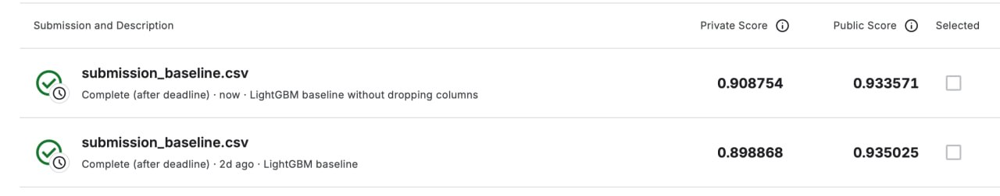
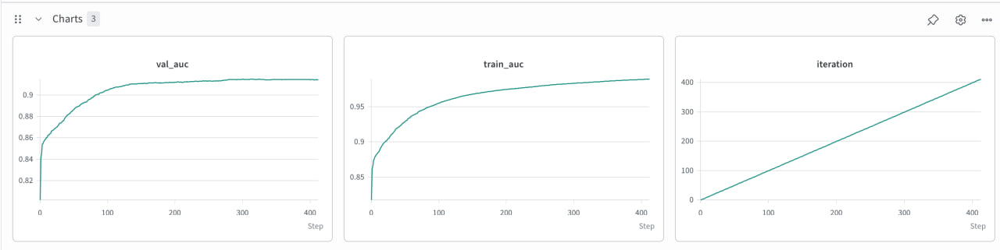
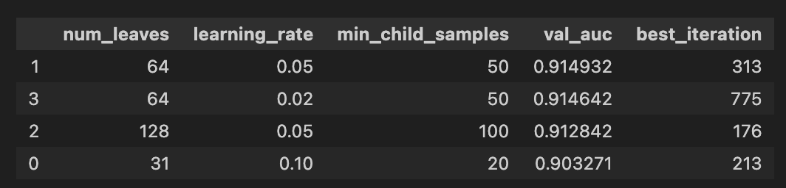
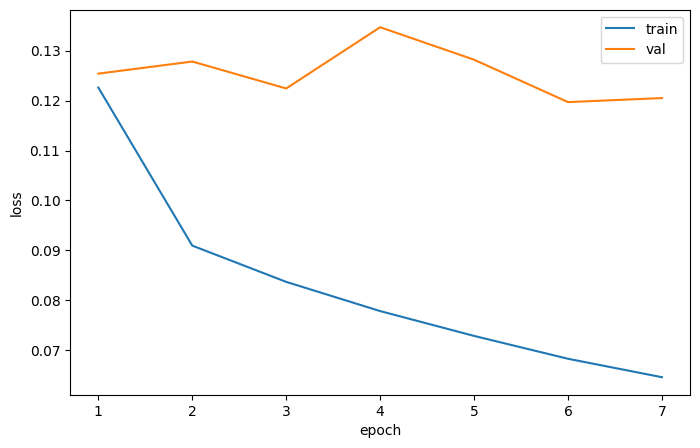
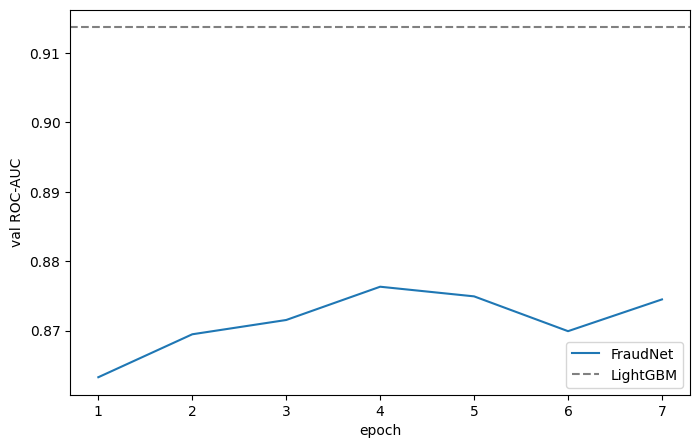
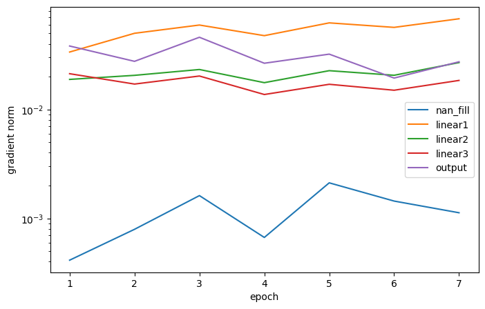
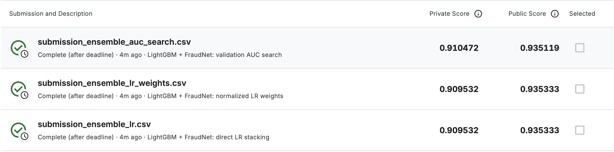

# Progress Report: IEEE Fraud Detection

This report outlines the progress made so far on the IEEE Fraud Detection project. We have completed the Exploratory Data Analysis (EDA), set up a robust validation strategy, and established our initial Machine Learning baseline. 

[Project Repository](https://github.com/koalla05/deep-learning-assignment1)

## 1. Exploring the Data (EDA) and Target Metrics

Before building any models, we needed to understand the shape and quirks of the dataset. The core challenge is immediately obvious: fraud is rare. Only about 3.5% of the transactions in the dataset are fraudulent. 


We also looked at how complete the data is. Out of 434 columns, many have a massive amount of missing information. Understanding which features are mostly empty helps us decide what to keep, drop, or fill in later.


To figure out which features actually help separate a normal transaction from a fraudulent one, we used two statistical tools, keeping things simple:

*   **Cohen’s d:** Can be explained as the measure of the "effect size." It looks at the distance between the average value for legitimate transactions and the average value for fraudulent ones, scaled by how spread out the data is. It works on continuous variables. Basically, it tells us how far apart the two groups naturally sit. 
$$d = \frac{\mu_{fraud} - \mu_{legit}}{\sqrt{\frac{\sigma_{legit}^2 + \sigma_{fraud}^2}{2}}}$$

*   **KS-Statistic (Kolmogorov-Smirnov):** It compares the overall shape of the data for both groups. It scans the distributions and finds the exact point where the two groups differ the most. It also works with continuous variables. It's useful for spotting features that behave fundamentally differently depending on whether the transaction is fraud or not.
$$D = \max_{x} \vert{}F_{fraud}(x) - F_{legit}(x)\vert{}$$

  $F_{fraud}(x)$ and $F_{legit}(x)$: *represent the "running percentage" (CDF - Cumulative Distribution Function) of the data. For any given value $x$, $F_{fraud}(x)$ tells us exactly what percentage of all fraudulent transactions have a value of $x$ or lower.* 
  
  **$\max_x$ operator**: *acts as a scanner. It calculates the vertical distance between the two running-percentage curves at every single point $x$, and returns the **single largest gap** it finds.*

### Feature Groups

#### Time-Leaking D-columns
The dataset includes 15-`D` columns, which represent time deltas such as the number of days since a previous transaction. By plotting those D-columns against the `TransactionDT`, we can visually inspect the time leaking (correlation).


That findings prompted us to handle the D-columns carefully in the ML pipeline.

#### V-Column Redundancy & Collinearity
The dataset contains 339 engineered `V-columns`, making up a majority of our feature space. To determine if this high dimensionality contained unique information or repeated signals, we audited the block structure of these features. 

By grouping the columns based on their exact `NaN` missingness footprints, we confirmed that Vesta generated these features in distinct batches. We then sampled the dataset to compute a pairwise correlation matrix. The analysis revealed significant structural redundancy, with hundreds of feature pairs exhibiting correlations greater than 0.90.


We generated a hierarchical clustermap on a subset of the V-columns to visualize this collinearity. The dendrograms successfully grouped the features into highly correlated, dense blocks. This redundancy indicates that the V-columns do not provide 339 unique dimensions of variance, fully justifying our later experiments with PCA.

## 2. Validation Strategy & Adversarial Validation

In fraud detection, time features play a big role. Especially in the current dataset as the train set and test set are separated chronologically. Other than that, malicious actors can change their tactics over time, so a model trained on past data might struggle with future data ("concept drift"). 

To mimic the real-world test environment of the competition, we created a **Single Time-Based Holdout Split**. We train on older data and test on newer data. Crucially, we added a **30-day purge gap** between the training and testing sets. By intentionally ignoring this 30-day chunk of data, we prevent our model from "cheating" or memorizing short-term temporal patterns (temporal leakage).

### Adversarial Validation Results
To truly understand how the change of time shifts the data distribution, we ran an Adversarial Validation test. We trained a Logistic Regression model (using 5-fold stratified K-fold cross-validation) with a very specific goal: **can it guess whether a row belongs to the Training set or the Test set?** If it can easily tell them apart, it means our data is shifting over time, and the local validation scores might not reflect true performance.

#### Findings:
*   **The Obvious Leakage:** When we left the `TransactionDT` (time) and `TransactionID` columns in, the model scored an AUC of ~1.0000. This makes perfect sense b/c we split the train and test sets chronologically therefore any time-related column trivially gives away the answer.
*   **Removing Time:** We removed the ID, time, and all raw "D-columns" (which contain time-deltas). The AUC dropped to $0.7235$. This means that even without obvious time markers, the Train and Test sets are still clearly distinguishable.
*   **Testing PCA on V-columns:** We tried replacing the massive block of 339 "V-columns" with PCA components (squashing them down to about 92 components explaining 95% of the variance). The AUC barely moved, landing at $0.7035$. This tells us the PCA compression didn't introduce new drift, but it didn't hide the existing drift either.
*   **The C-columns features:** Looking at feature importance drawn from regression model, we saw that the shift between train and test is also driven by the "C-columns" (specifically C11, C12, C4, C7, C9, C6, C14, C8, C2), along with a few secondary signals from the PCA components. Because C-columns are cumulative counting features, it makes sense that their values naturally grow and drift as more transactions pile up over the ~395-day span of the dataset.


**The takeaway:** Interestingly, when we tried completely dropping the worst drifting C-columns (C12, C10, C4, C7), the AUC stayed put at 0.7081. There was no visible reduction in drift. This means our local validation scores might still be a bit optimistic compared to the actual leaderboard, and we must treat these C-columns very cautiously when training our final models.

##### Adversarial Validation Pitfalls
At some point after we implemented the validation we have noticed that there was a data leakage at imputer's level as it was trained on all data, while some part of that data was hidden at the time of KFold cv. We addressed the issue by intoroducing the `sklearn.Pipeline`. 

## 3. Machine Learning Baseline

### Feature Engineering 

* **Time features** — hour of day / day of week from `TransactionDT` (fraud showed clear time-of-day patterns in EDA).
* **`TransactionAmt` transforms** — `log1p` (heavy right skew) and the decimal part.
* **`D`-column detrending** — subtract elapsed dataset time from the non-stationary `D` columns, as found during EDA, so trees don't split on values that never occur this early in time again.
* **Frequency encoding** — for high-cardinality categoricals (`card1`, `addr1`, `P_emaildomain`, `DeviceInfo`), replacing raw IDs with how often they occur.
* **Label encoding** — for the remaining categorical columns, so LightGBM can consume them as `category` dtype.
* **Drift-prone columns dropped** — `C11, C12, C10, C4, C7` were flagged by adversarial validation in `validation.ipynb` as the strongest train/test drift drivers; we drop them for the baseline to avoid overfitting to a shift that won't hold at test time.
* **No PCA** for V-columns as LightGBM handles them natively through EFB.

> **Note:** the impact of dropping some of C-columns can be seen in the **Feature importance** section.

### Validation split

**Strategy:** days 1–122 train, 30-day purge gap (123–152), days 153–182 validation**, so local scores are comparable to what we will see on the leaderboard.

### Model parameters
``` python
params = {
    'objective': 'binary',
    'metric': 'auc',
    'boosting_type': 'gbdt',
    'learning_rate': 0.05,
    'num_leaves': 64,
    'max_depth': -1,
    'min_child_samples': 50,
    'subsample': 0.8,
    'colsample_bytree': 0.7,
    'reg_alpha': 0.1,
    'reg_lambda': 0.1,
    'n_estimators': 2000,
    'random_state': SEED, # 42
    'n_jobs': -1,
}
```

> **Note:** even though AUC is chosen as the evaluation metric, PR-AUC, F1 scores used as well: 
```
Validation ROC-AUC:  0.9118
Validation PR-AUC:   0.5634
Validation F1 (@0.5): 0.5022  # Threshold 0.5
```

### Feature importance 


> **Note:** the Gain means reduction in error (increase in accuracy) contributed by all the splits that used a specific feature.

#### C-columns droppage impact



*The droppage of the columns resulted in slightly superior score on **Private** leaderboard, while **Public** score stayed roughly the same.*

> **Note:** that prompts us to review the necessity of dropping those columns for DL model.

### Machine Baseline Training


### Parameters tuning
We have run multiple rounds of training and validation to resolve the best parameters for ML baseline:



### Regularization Techniques
**Early stopping**  
During training with `eval_set`, LightGBM checks the validation metric (`val` AUC) after every boosting round and stops once it hasn't improved for `stopping_rounds` consecutive rounds. `best_iteration_` records the round where validation performance actually peaked —
this avoids both underfitting (too few trees) and overfitting (too many), without us having to guess `n_estimators` by hand.

**We scale `best_iteration_` by 1.1x for the final refit.** The final refit trains on `X_full = train + val` combined, with no held-out `eval_set` — there's nothing left to monitor, early stopping can't run on this fit at all. We're forced to pick a fixed `n_estimators` up front.

The `best_iteration_` we have (313) was the optimal stopping point on the smaller `X_train`-only fold (420k rows). `X_full` has ~20% more rows (505k). More training data generally supports a few more useful trees before overfitting becomes a problem, since each split is estimated with more examples and there's more signal to fit. So reusing only 313 unchanged would likely limit our abilities in training.

### Local submission vs Leaderboard
#### First submission:

| Split                 | ROC-AUC  |
|-----------------------|----------|
| Local validation (baseline params, cell 14) | 0.9118 |
| Local validation (tuned params, **used for final submission**) | 0.9137 |
| Public leaderboard     | 0.935025 |
| Private leaderboard    | **0.898868** |

#### Second submission:

| Split                 | ROC-AUC  |
|-----------------------|----------|
| Local validation (baseline params) | 0.9149 |
| Local validation (tuned params, **used for final submission**) | 0.9149 |
| Public leaderboard     | 0.933571 |
| Private leaderboard    | **0.908754** |

> **Note:** Second submission without dropping the five C columns improved model performance across both local validation (0.9137 → 0.9149) and the Private Leaderboard (0.8988 → 0.9087), confirming that the initial decision to drop them was based on a wrong assumption and a flawed adversarial validation setup.


### ML baseline conclusion and highlights

- **Tuning**: a 4-point manual parameters tuning `num_leaves`, `learning_rate` `min_child_samples` did not improve local validation AUC - 0.9149 → 0.9149 (`num_leaves=128, lr=0.05, min_child_samples=100`, best_iteration=160).

- **Result**: local validation ROC-AUC 0.9149 → Public LB 0.933571, Private LB 0.908754.

- **Is the baseline adequate?** Yes, as a reference point — an ROC-AUC around 0.90–0.91 is a reasonable, leakage-checked LightGBM result for this task. It may not be the final model, but it gives a solid ground to look at.

- **Main caveat**: the 0.024 gap between public and private leaderboard scores is larger than the local train/val gap would suggest, and is most likely driven by time-based drift in the test set that our holdout - despite the purge gap - doesn't fully capture. 

## 4. Deep Learning Model (FraudNet)

While tree-based models like LightGBM excel at tabular datasets, we wanted to build a deep learning architecture to test whether neural networks can capture deeper interactions across the hundreds of masked and engineered features. We designed a custom PyTorch model named **FraudNet**, specifically adapted for mixed high-cardinality categorical and continuous tabular data.

### Preprocessing & Feature Encoding

Neural networks are sensitive to unscaled inputs, heavy tails, and extreme outliers. To prepare the features for gradient-based training, we built a dedicated preprocessing pipeline (`Prep`):

* **Quantile Transformation:** Passed all 387 numerical features (383 raw/detrended features plus 4 frequency-encoded columns) through `QuantileTransformer(n_quantiles=1000, output_distribution="normal")`. This maps skewed variables (such as `TransactionAmt` and counting columns) into standard bell curves, stabilizing layer inputs.
* **Frequency Encoding:** Maintained frequency encoding for the four key high-cardinality features (`card1`, `addr1`, `P_emaildomain`, `DeviceInfo`) from the ML baseline.
* **Entity Embeddings:** Categorical features with category frequency $\ge 10$ were assigned unique integer indices. Unseen categories and missing values were mapped to dedicated tokens ($1$ for rare/unseen, $0$ for `NaN`). Each of the 51 categorical columns was mapped into an 8-dimensional learnable embedding via `nn.Embedding(num_categories, 8)`.

### Custom PyTorch Implementations

To satisfy the core assignment requirements and tailor the pipeline to tabular fraud data, we implemented two custom components from scratch:

#### 1. Custom Layer: Learnable NaN Imputation (`NanFill`)
Rather than relying on static median or zero-imputation before training, we designed a custom `nn.Module` with a learnable parameter vector:

```python
class NanFill(nn.Module):
    def __init__(self, n_features):
        super().__init__()
        self.fill = nn.Parameter(torch.zeros(n_features))

    def forward(self, x):
        return torch.where(torch.isnan(x), self.fill, x)
```

During forward passes, `NanFill` detects `NaN` positions in the transformed continuous features and replaces them with `self.fill`. This allows backpropagation to optimize the imputed values specifically for downstream fraud classification.

#### 2. Custom Optimizer: Decoupled Weight Decay (`AdamW`)
We implemented a custom optimizer subclassing `torch.optim.Optimizer` that decouples weight decay from the adaptive gradient moment updates:

```python
class AdamW(torch.optim.Optimizer):
    def __init__(self, params, lr=1e-3, betas=(0.9, 0.999), eps=1e-8, weight_decay=1e-2):
        defaults = dict(lr=lr, betas=betas, eps=eps, weight_decay=weight_decay)
        super().__init__(params, defaults)

    @torch.no_grad()
    def step(self):
        for group in self.param_groups:
            lr, (beta1, beta2), eps, wd = group["lr"], group["betas"], group["eps"], group["weight_decay"]
            for p in group["params"]:
                if p.grad is None:
                    continue
                g = p.grad
                state = self.state[p]
                if len(state) == 0:
                    state["t"] = 0
                    state["m"] = torch.zeros_like(p)
                    state["v"] = torch.zeros_like(p)

                state["t"] += 1
                p *= 1 - lr * wd  # Decoupled weight decay
                state["m"] = beta1 * state["m"] + (1 - beta1) * g
                state["v"] = beta2 * state["v"] + (1 - beta2) * g ** 2
                m_hat = state["m"] / (1 - beta1 ** state["t"])
                v_hat = state["v"] / (1 - beta2 ** state["t"])
                p -= lr * m_hat / (v_hat.sqrt() + eps)
```

Decoupled weight decay prevents large historical gradients from shrinking regularization penalties, improving generalization on noisy tabular signals.

### Model Architecture

`FraudNet` combines the continuous features (processed by `NanFill`) with the flattened 51 categorical embeddings ($51 \times 8 = 408$ dimensions) for a total input dimension of $387 + 408 = 795$ features.

The backbone is a funnel-shaped Multi-Layer Perceptron (MLP) regularized at every stage:
1. **Input Layer:** $795 \rightarrow 512$ (`Linear` $\rightarrow$ `BatchNorm1d` $\rightarrow$ `ReLU` $\rightarrow$ `Dropout(0.2)`)
2. **Hidden Layer 1:** $512 \rightarrow 256$ (`Linear` $\rightarrow$ `BatchNorm1d` $\rightarrow$ `ReLU` $\rightarrow$ `Dropout(0.2)`)
3. **Hidden Layer 2:** $256 \rightarrow 128$ (`Linear` $\rightarrow$ `BatchNorm1d` $\rightarrow$ `ReLU` $\rightarrow$ `Dropout(0.2)`)
4. **Head:** $128 \rightarrow 1$ (`Linear`, outputting raw logits)

* **Loss Function:** `nn.BCEWithLogitsLoss()`.
* **Batch Size:** 2048 with shuffling.
* **Scheduler:** `torch.optim.lr_scheduler.ExponentialLR(optimizer, gamma=0.8)` applied at every epoch.
* **Early Stopping:** Monitored on validation ROC-AUC with a patience of 3 epochs.

### Training Diagnostics & Health Checks

Training progress and gradient flows were tracked in Weights & Biases across each layer:







#### Optimization Observations:
* **Overfitting Dynamic:** Training loss decreases monotonically across epochs, but validation loss plateaus around $0.116 - 0.130$ after just $2 - 4$ epochs. Early stopping triggers reliably around epoch $4 - 6$ to preserve peak validation ROC-AUC.
* **Gradient Stability:** Gradient norms across all linear layers (`linear1`, `linear2`, `linear3`, `output`) remain bounded and stable on a logarithmic scale throughout training, showing neither exploding nor vanishing gradients.
* **`NanFill` Gradients:** The norm for `NanFill` is lower in magnitude because only missing entries receive non-zero gradients via `torch.where`, updating only the coordinates with unobserved values.

### Hyperparameter Tuning

We evaluated 6 hyperparameter configurations across learning rates, network capacities, and regularizations:

| Run | Configuration | Best Epoch | Validation ROC-AUC |
| :--- | :--- | :---: | :---: |
| **`lr-high`** | `lr=4e-3`, `dropout=0.2`, `hidden=512`, `wd=1e-2` | **4** | **0.880688** |
| **`small-net`** | `hidden=256`, `lr=2e-3`, `dropout=0.2`, `wd=1e-2` | 6 | 0.880515 |
| **`dropout-high`** | `dropout=0.4`, `lr=2e-3`, `hidden=512`, `wd=1e-2` | 4 | 0.879982 |
| **`wd-high`** | `weight_decay=1e-1`, `lr=2e-3`, `dropout=0.2` | 3 | 0.876399 |
| **`base`** | `lr=2e-3`, `dropout=0.2`, `hidden=512`, `wd=1e-2` | 4 | 0.876326 |
| **`lr-low`** | `lr=1e-3`, `dropout=0.2`, `hidden=512`, `wd=1e-2` | 3 | 0.874244 |

> **Note:** Validation AUC across all runs clustered within a tight range ($0.874 - 0.881$). The `lr-high` configuration achieved the highest validation score ($0.8807$) and was selected for the final submission model.

### Local Validation: FraudNet vs. LightGBM

Using the best-performing weights (`lr-high`), we evaluated complementary metrics on the local holdout validation fold:

| Metric | LightGBM Baseline | FraudNet (DL) |
| :--- | :---: | :---: |
| **ROC-AUC** | 0.9149 | 0.8807 |
| **PR-AUC** | 0.5634 | 0.4427 |
| **F1-Score (@0.5)** | 0.5022 | 0.4284 |

### Final Submission vs. Leaderboard

We retrained `FraudNet` on the full training set (all 182 days) using the `lr-high` hyperparameters for 4 epochs and submitted predictions to the competition:

| Split | LightGBM Baseline | FraudNet |
| :--- | :---: | :---: |
| **Local validation** | 0.9149 | 0.880688 |
| **Public leaderboard** | 0.933571 | 0.915955 |
| **Private leaderboard** | **0.908754** | **0.884124** |

### Deep Learning Conclusions and Highlights

* **Tabular Performance Comparison:** LightGBM remains superior across all splits (local, public, and private), which aligns with standard empirical findings on tabular fraud datasets with heterogeneous feature structures.
* **Generalization and Drift Gap:** FraudNet exhibits a smaller drop-off when moving to the temporally distant private test set. While the local gap between LightGBM and FraudNet was $\approx 0.034$ AUC points, the gap narrowed to $\approx 0.024$ on the Private Leaderboard. The quantile transformation and batch normalization helped limit degradation caused by uncalibrated feature shifts.
* **Rapid Convergence:** The network reached its optimal validation performance within $4$ epochs. Training beyond that point resulted in overfitting on training loss while validation metrics degraded.
* **Adequacy of the Model:** FraudNet achieves an 0.884 Private Leaderboard AUC without extensive feature interaction engineering, serving as a functional, leak-free neural baseline suitable for ensembling.


## 5. Ensemble Strategy

To determine whether our neural network could add useful, complementary signals to our strong tree-based baseline, we combined LightGBM and FraudNet into an ensemble. A quick check of their validation probabilities revealed a correlation of **0.734**. Since the correlation is relatively low (well below 0.90), it indicates the models are learning different patterns, making them excellent candidates for ensembling.

### Two-Stage Training & Leakage Prevention

A common pitfall in ensembling is fitting the meta-learner (the blender) on the same data used to train the base models, leading to severe overfitting. To prevent this, and to respect our strict temporal split, we implemented a **Two-Stage** approach:

**Stage 1: Weight Discovery**
1. **Base Training:** We trained "holdout" versions of LightGBM and FraudNet strictly on **Days 1–122**. 
2. **Meta-Feature Generation:** We used these holdout models to predict probabilities on our validation set (**Days 153–182**). 
3. **Weight Calculation:** We evaluated three different blending strategies on these validation predictions to find the optimal combination weights. Once found, these weights were locked and frozen.

**Stage 2: Final Refit & Inference**
1. **Retraining Base Models:** We discarded the holdout models and trained fresh versions on more data to maximize their predictive power for the test set. LightGBM was trained on Days 1–122 + 153–182 (maintaining the 30-day purge gap), while FraudNet was trained on all 182 labeled days. 
2. **Applying Frozen Weights:** We generated test set predictions using the newly refitted models, and then combined them using the exact weights discovered in Stage 1. 

### Blending Methods and Validation Results

During the Weight Discovery stage, we evaluated the following blending methods on the validation fold:

* **50/50 Blend:** A simple baseline average.
* **Method A (LR Stacking):** A Logistic Regression meta-model (`C=0.1`) trained directly on the base model probabilities.
* **Method B (LR Normalized Weights):** Extracting the coefficients from the Logistic Regression model and normalizing them so they sum to 1.0 (yielding roughly 72% LightGBM, 28% FraudNet).
* **Method C (AUC Grid Search):** A brute-force search stepping through weights from 0.00 to 1.00 to find the exact combination that maximizes ROC-AUC. 

| Method | Validation ROC-AUC | Validation PR-AUC |
| :--- | :---: | :---: |
| **AUC Grid Search** | **0.9130** | 0.5489 |
| **LightGBM (Alone)** | 0.9122 | **0.5498** |
| **LR Stacking** | 0.9090 | 0.5271 |
| **LR Normalized Weights** | 0.9090 | 0.5271 |
| **50/50 Blend** | 0.9032 | 0.4978 |
| **FraudNet (Alone)** | 0.8761 | 0.4121 |

**Weight Selection Analysis:** 
The brute-force AUC grid search achieved the highest validation score, narrowly beating the standalone LightGBM model. However, the optimal weights heavily favored the tree model: **0.96 for LightGBM and 0.04 for FraudNet**. While FraudNet's contribution was small, it provided just enough orthogonal signal to push the peak AUC higher.

### Final Leaderboard Results

We exported the predictions from our three blending methods and submitted them to the competition to see how the frozen validation weights generalized to the unseen Private Leaderboard:



> **Conclusion:** The ensemble process proved that while LightGBM carries the vast majority of the predictive power for this tabular dataset, the structural diversity of a deep learning model can still be harnessed to squeeze out minor performance gains without introducing temporal leakage.