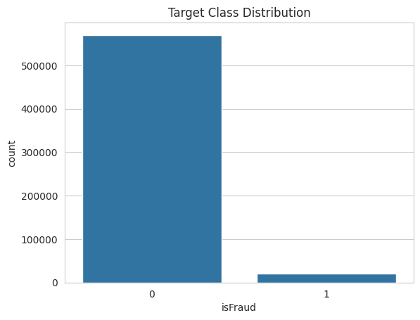
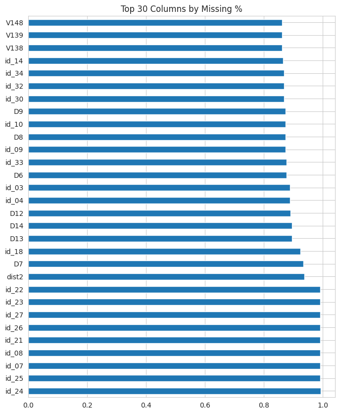
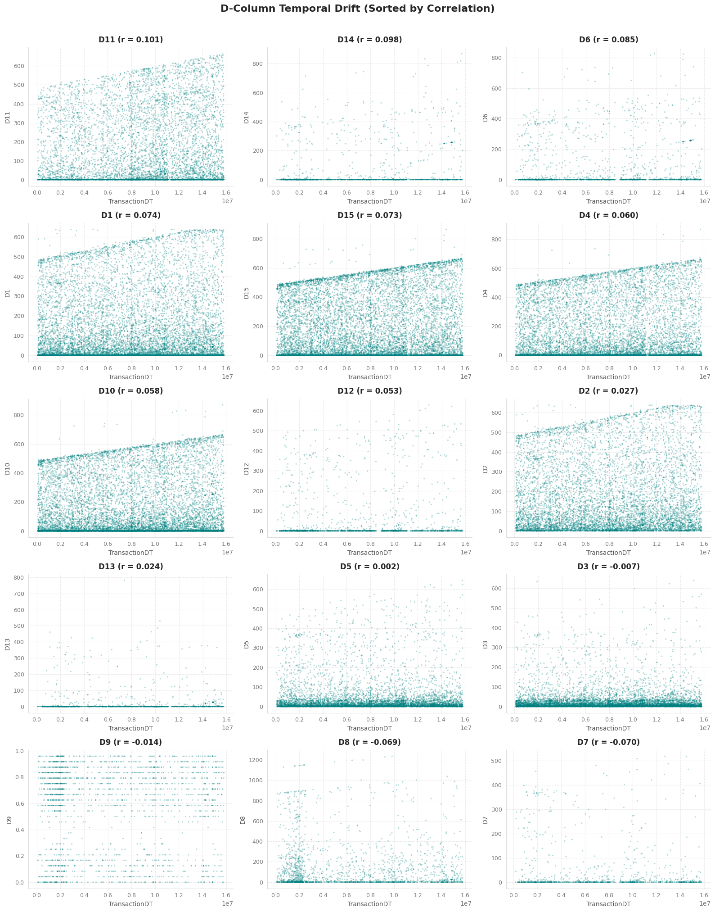
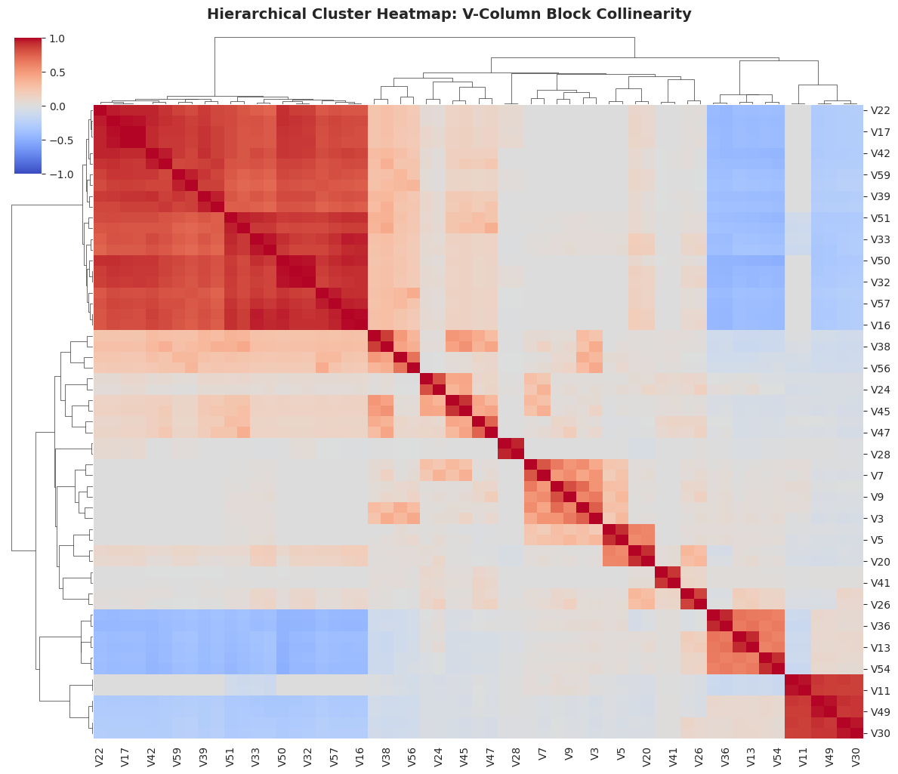
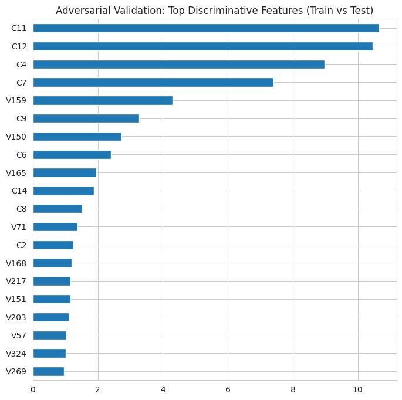
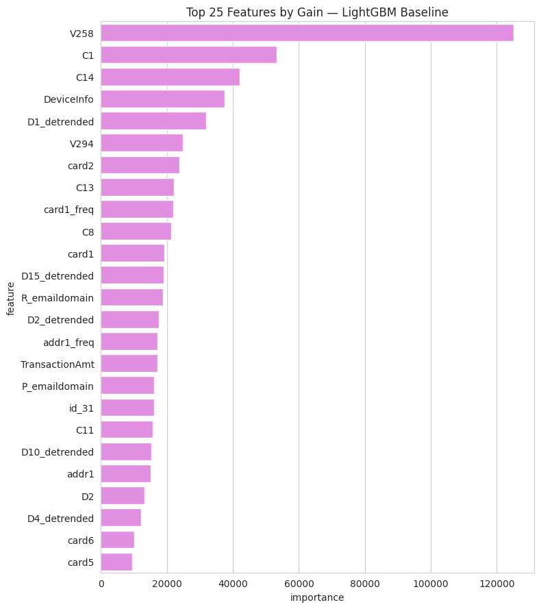

# Progress Report: IEEE Fraud Detection

This report outlines the progress made so far on the IEEE Fraud Detection project. We have completed the Exploratory Data Analysis (EDA), set up a robust validation strategy, and established our initial Machine Learning baseline. 

## 1. Exploring the Data (EDA) and Target Metrics

Before building any models, we needed to understand the shape and quirks of the dataset. The core challenge is immediately obvious: fraud is rare. Only about 3.5% of the transactions in the dataset are fraudulent. 

We also looked at how complete the data is. Out of 434 columns, many have a massive amount of missing information. Understanding which features are mostly empty helps us decide what to keep, drop, or fill in later.

To figure out which features actually help separate a normal transaction from a fraudulent one, we used two statistical tools, keeping things simple:

*   **Cohen’s d:** Can be explained as the measure of the "effect size." It looks at the distance between the average value for legitimate transactions and the average value for fraudulent ones, scaled by how spread out the data is. It works on continuous variables. Basically, it tells us how far apart the two groups naturally sit. 
$$d = \frac{\mu_{fraud} - \mu_{legit}}{\sqrt{\frac{\sigma_{legit}^2 + \sigma_{fraud}^2}{2}}}$$

*   **KS-Statistic (Kolmogorov-Smirnov):** It compares the overall shape of the data for both groups. It scans the distributions and finds the exact point where the two groups differ the most. It also works with continuous variables. It's useful for spotting features that behave fundamentally differently depending on whether the transaction is fraud or not.
$$D = \max_{x} \vert{}F_{fraud}(x) - F_{legit}(x)\vert{}$$

  $F_{fraud}(x)$ and $F_{legit}(x)$: *represent the "running percentage" (CDF - Cumulative Distribution Function) of the data. For any given value $x$, $F_{fraud}(x)$ tells us exactly what percentage of all fraudulent transactions have a value of $x$ or lower.* 
  
  **$\max_x$ operator**: *acts as a scanner. It calculates the vertical distance between the two running-percentage curves at every single point $x$, and returns the **single largest gap** it finds.*

### Feature Groups

#### Time-Leaking D-columns
The dataset includes 15-`D` columns, which represent time deltas such as the number of days since a previous transaction. By plotting those D-columns against the `TransactionDT`, we can visually inspect the time leaking (correlation).

That findings prompted us to handle the D-columns carefully in the ML pipeline.

#### V-Column Redundancy & Collinearity
The dataset contains 339 engineered `V-columns`, making up a majority of our feature space. To determine if this high dimensionality contained unique information or repeated signals, we audited the block structure of these features. 

By grouping the columns based on their exact `NaN` missingness footprints, we confirmed that Vesta generated these features in distinct batches. We then sampled the dataset to compute a pairwise correlation matrix. The analysis revealed significant structural redundancy, with hundreds of feature pairs exhibiting correlations greater than 0.90.

We generated a hierarchical clustermap on a subset of the V-columns to visualize this collinearity. The dendrograms successfully grouped the features into highly correlated, dense blocks. This redundancy indicates that the V-columns do not provide 339 unique dimensions of variance, fully justifying our later experiments with PCA.

## 2. Validation Strategy & Adversarial Validation

In fraud detection, time features play a big role. Especially in the current dataset as the train set and test set are separated chronologically. Other than that, malicious actors can change their tactics over time, so a model trained on past data might struggle with future data ("concept drift"). 

To mimic the real-world test environment of the competition, we created a **Single Time-Based Holdout Split**. We train on older data and test on newer data. Crucially, we added a **30-day purge gap** between the training and testing sets. By intentionally ignoring this 30-day chunk of data, we prevent our model from "cheating" or memorizing short-term temporal patterns (temporal leakage).

### Adversarial Validation Results
To truly understand how the change of time shifts the data distribution, we ran an Adversarial Validation test. We trained a Logistic Regression model (using 5-fold stratified K-fold cross-validation) with a very specific goal: **can it guess whether a row belongs to the Training set or the Test set?** If it can easily tell them apart, it means our data is shifting over time, and the local validation scores might not reflect true performance.

#### Findings:
*   **The Obvious Leakage:** When we left the `TransactionDT` (time) and `TransactionID` columns in, the model scored an AUC of ~1.0000. This makes perfect sense b/c we split the train and test sets chronologically therefore any time-related column trivially gives away the answer.
*   **Removing Time:** We removed the ID, time, and all raw "D-columns" (which contain time-deltas). The AUC dropped to $0.7235$. This means that even without obvious time markers, the Train and Test sets are still clearly distinguishable.
*   **Testing PCA on V-columns:** We tried replacing the massive block of 339 "V-columns" with PCA components (squashing them down to about 92 components explaining 95% of the variance). The AUC barely moved, landing at $0.7035$. This tells us the PCA compression didn't introduce new drift, but it didn't hide the existing drift either.
*   **The C-columns features:** Looking at feature importance drawn from regression model, we saw that the shift between train and test is also driven by the "C-columns" (specifically C11, C12, C4, C7, C9, C6, C14, C8, C2), along with a few secondary signals from the PCA components. Because C-columns are cumulative counting features, it makes sense that their values naturally grow and drift as more transactions pile up over the ~395-day span of the dataset.

**The takeaway:** Interestingly, when we tried completely dropping the worst drifting C-columns (C12, C10, C4, C7), the AUC stayed put at 0.7081. There was no visible reduction in drift. This means our local validation scores might still be a bit optimistic compared to the actual leaderboard, and we must treat these C-columns very cautiously when training our final models.

##### Adversarial Validation Pitfalls
At some point after we implemented the validation we have noticed that there was a data leakage at imputer's level as it was trained on all data, while some part of that data was hidden at the time of KFold cv. We addressed the issue by intoroducing the `sklearn.Pipeline`. 

## 3. Machine Learning Baseline

With our validation strategy locked in, we built our first ML model to set a baseline: a LightGBM (Gradient boosting decision tree) model. 

Based on what we learned from the exploratory and adversarial phases, we applied a few key preprocessing steps:
*   Applied mathematical transformations (like `log1p`) to the transaction amounts to handle extreme outliers.
*   Detrended the non-stationary D-columns.
*   Dropped the features we identified as highly susceptible to drift.

> **Note:** we did not use PCA for the input features as LightGBM handles feature selection natively using Exclusive Feature Bundling.

By setting up this baseline, we now have a solid benchmark to compare against as we move into more complex Deep Learning architectures.

